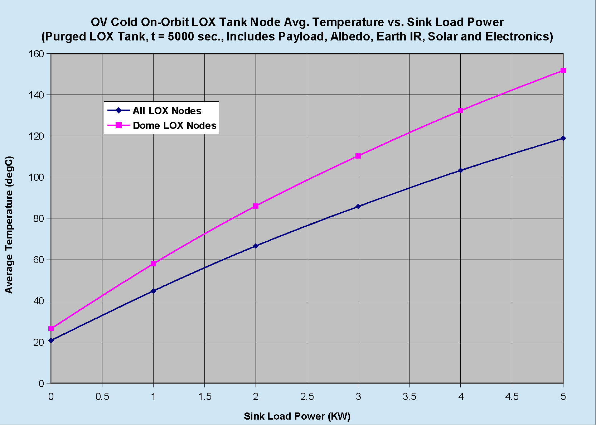

# ========================================
# OV Cold On Orbit LOX Tank Tavg vs Load Power Parametric Thermal Analysis:
# ========================================

## Orbital Vehicle Cold On Orbit LOX Tank Tavg vs Load Power Parametric Thermal Analysis using SindaG.

##
## I. LOX Tank Tavg vs Load Power Parametric Study:

## II. SindaG Input Files:
### IIa. "./preprocessor/SF_OV_on_orbit_d.inp"
### IIb. "./preprocessor/SF_OV_on_orbit_node_a.inp"
### IIc. "./preprocessor/SF_OV_on_orbit_cond_a.inp"
### IId. "./preprocessor/SF_OV_on_orbit_varb1_a.inp"
### IIe. "./preprocessor/SF_OV_on_orbit_array_a.inp"

## II. Case Results Output:
### IIa. Load Power = 0kw: "./SINDA/load_power_0kw/SF_OV_on_orbit_a.out"
### IIb. Load Power = 1kw: "./SINDA/load_power_0kw/SF_OV_on_orbit_a.out"
### IIc. Load Power = 2kw: "./SINDA/load_power_0kw/SF_OV_on_orbit_a.out"
### IId. Load Power = 3kw: "./SINDA/load_power_0kw/SF_OV_on_orbit_a.out"
### IIe. Load Power = 4kw: "./SINDA/load_power_0kw/SF_OV_on_orbit_a.out"
### IIf. Load Power = 5kw: "./SINDA/load_power_0kw/SF_OV_on_orbit_a.out"

## 
## *Note: 
## 1. Thermal Analysis performed using SINDA-G, ( http://www.mscsoftware.com/product/sinda )

